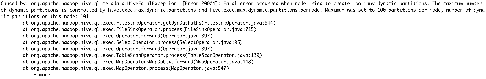

[TOC]

# 1. 前言

本文是基于Apache Kylin对Airline数据进行航班准点率、平均延误时间、航班数等方面的分析计算的关于Hive的衍生部分。

本案例中的Airline数据集来自美国交通运输部，数据主要包含的是美国本土主流航空公司的飞机起降信息。包括飞行日期信息(FlightDate)，航班信息(UniqueCarrier,AirlineID)，机场信息（DestCityName,OriginCityName），起飞指标（DepTime,DepDelay），降落指标（ArrTime,ArrDelay），飞行信息(Airtime,Distance)等等。

# 2. 数据来源

下载地址：https://www.transtats.bts.gov/DL_SelectFields.asp?Table_ID=236&DB_Short_Name=On-Time

数据文件格式: CSV

时间区间: 2000-1 ~ 2020-6

数据量: 65,115,868 条数据（126个文件 / 27.3 G）

**注意**：由于我是在笔记本上搭建的hadoop，性能受到影响，请根据实际选择合适的数据量。

# 3. 数据初步分析

在使用数据之前，我们需要先来了解本文主要使用的几个字段所代表的含义：

[readme.html](docs/readme.html)

# 4. 导入数据

第一步，上传数据到HDFS上，本案例中，我们上传的数据放在HDFS的 /data/airline目录下。

第二步，在hive中创建一个数据库 airline

在hive中运行命令：

```sql
create database airline;
use airline;
```

# 5. 创建外部表

根据原数据中数据结构和类型，在hive中构建表。

原数据的文件保存在HDFS的 /data/airline 的目录下，我们可以通过Hive 外部表对原数据进行访问，并不需要将表中的数据全部装载进数据库中，这里，我们首先创建一个外部表 airline_data。

- 在hive中运行命令：

    ```sql
    CREATE EXTERNAL TABLE airline_data (
    Year int,
    Quarter int,
    Month int,
    DayofMonth int,
    DayOfWeek int,
    FlightDate date,
    UniqueCarrier string,
    AirlineID bigint,
    Carrier string,
    TailNum string,
    FlightNum int,
    OriginAirportID bigint,
    OriginAirportSeqID bigint,
    OriginCityMarketID bigint,
    Origin string,
    OriginCityName string,
    OriginState string,
    OriginStateFips int,
    OriginStateName string,
    OriginWac int,
    DestAirportID int,
    DestAirportSeqID bigint,
    DestCityMarketID bigint,
    Dest string,
    DestCityName string,
    DestState string,
    DestStateFips int,
    DestStateName string,
    DestWac int,
    CRSDepTime int,
    DepTime int,
    DepDelay int,
    DepDelayMinutes int,
    DepDel15 int,
    DepartureDelayGroups int,
    DepTimeBlk string,
    TaxiOut int,
    WheelsOff int,
    WheelsOn int,
    TaxiIn int,
    CRSArrTime int,
    ArrTime int,
    ArrDelay int,
    ArrDelayMinutes int,
    ArrDel15 int,
    ArrivalDelayGroups int,
    ArrTimeBlk string,
    Cancelled int,
    CancellationCode string,
    Diverted int,
    CRSElapsedTime int,
    ActualElapsedTime int,
    AirTime int,
    Flights int,
    Distance bigint,
    DistanceGroup int,
    CarrierDelay int,
    WeatherDelay int,
    NASDelay int,
    SecurityDelay int,
    LateAircraftDelay int,
    FirstDepTime int,
    TotalAddGTime int,
    LongestAddGTime int,
    DivAirportLandings int,
    DivReachedDest int,
    DivActualElapsedTime int,
    DivArrDelay int,
    DivDistance int,
    Div1Airport int,
    Div1AirportID int,
    Div1AirportSeqID int,
    Div1WheelsOn int,
    Div1TotalGTime int,
    Div1LongestGTime int,
    Div1WheelsOff int,
    Div1TailNum int,
    Div2Airport int,
    Div2AirportID int,
    Div2AirportSeqID int,
    Div2WheelsOn int,
    Div2TotalGTime int,
    Div2LongestGTime int,
    Div2WheelsOff int,
    Div2TailNum int,
    Div3Airport int,
    Div3AirportID int,
    Div3AirportSeqID int,
    Div3WheelsOn int,
    Div3TotalGTime int,
    Div3LongestGTime int,
    Div3WheelsOff int,
    Div3TailNum int,
    Div4Airport int,
    Div4AirportID int,
    Div4AirportSeqID int,
    Div4WheelsOn int,
    Div4TotalGTime int,
    Div4LongestGTime int,
    Div4WheelsOff int,
    Div4TailNum int,
    Div5Airport int,
    Div5AirportID int,
    Div5AirportSeqID int,
    Div5WheelsOn int,
    Div5TotalGTime int,
    Div5LongestGTime int,
    Div5WheelsOff int,
    Div5TailNum int
    )
    ROW FORMAT SERDE 'org.apache.hadoop.hive.serde2.OpenCSVSerde'
    WITH SERDEPROPERTIES ("separatorChar" = ",")
    LOCATION '/data/airline'
    TBLPROPERTIES('serialization.null.format'='','skip.header.line.count'='1');
    ```

**注意**：由于本文引用的Airline数据的文件是用逗号(“,”)作为分隔符的，
 然而文件中的数据也包含有逗号(“,”)，因此单纯用`ROW FORMAT DELIMITED FIELDS TERMINATED BY ','`去分割符语句，
 会将文件中的逗号(“,”)也当成分隔符来处理，造成该字段后面的字段数据载入错位。
 所以此处需要引用一个插件包`ROW FORMAT SERDE 'org.apache.hadoop.hive.serde2.OpenCSVSerde' WITH SERDEPROPERTIES ("separatorChar" = ",")`来处理以上问题；

# 6. 创建分区表

Apache Kylin支持递增式构建Cube，因此如果Hive原始表是分区的，Apache Kylin 在递增式构建时获取数据的性能会更高。这里我们按照飞行日期（FlightDate）对 airline_data 的数据进行分区，创建表名为airline的分区表。

- 在hive中运行命令：

    ```sql
    CREATE TABLE airline (
    Year int,
    Quarter int,
    Month int,
    DayofMonth int,
    DayOfWeek int,
    UniqueCarrier string,
    AirlineID bigint,
    Carrier string,
    TailNum string,
    FlightNum int,
    OriginAirportID bigint,
    OriginAirportSeqID bigint,
    OriginCityMarketID bigint,
    Origin string,
    OriginCityName string,
    OriginState string,
    OriginStateFips int,
    OriginStateName string,
    OriginWac int,
    DestAirportID int,
    DestAirportSeqID bigint,
    DestCityMarketID bigint,
    Dest string,
    DestCityName string,
    DestState string,
    DestStateFips int,
    DestStateName string,
    DestWac int,
    CRSDepTime int,
    DepTime int,
    DepDelay int,
    DepDelayMinutes int,
    DepDel15 int,
    DepartureDelayGroups int,
    DepTimeBlk string,
    TaxiOut int,
    WheelsOff int,
    WheelsOn int,
    TaxiIn int,
    CRSArrTime int,
    ArrTime int,
    ArrDelay int,
    ArrDelayMinutes int,
    ArrDel15 int,
    ArrivalDelayGroups int,
    ArrTimeBlk string,
    Cancelled int,
    CancellationCode string,
    Diverted int,
    CRSElapsedTime int,
    ActualElapsedTime int,
    AirTime int,
    Flights int,
    Distance bigint,
    DistanceGroup int,
    CarrierDelay int,
    WeatherDelay int,
    NASDelay int,
    SecurityDelay int,
    LateAircraftDelay int,
    FirstDepTime int,
    TotalAddGTime int,
    LongestAddGTime int,
    DivAirportLandings int,
    DivReachedDest int,
    DivActualElapsedTime int,
    DivArrDelay int,
    DivDistance int,
    Div1Airport int,
    Div1AirportID int,
    Div1AirportSeqID int,
    Div1WheelsOn int,
    Div1TotalGTime int,
    Div1LongestGTime int,
    Div1WheelsOff int,
    Div1TailNum int,
    Div2Airport int,
    Div2AirportID int,
    Div2AirportSeqID int,
    Div2WheelsOn int,
    Div2TotalGTime int,
    Div2LongestGTime int,
    Div2WheelsOff int,
    Div2TailNum int,
    Div3Airport int,
    Div3AirportID int,
    Div3AirportSeqID int,
    Div3WheelsOn int,
    Div3TotalGTime int,
    Div3LongestGTime int,
    Div3WheelsOff int,
    Div3TailNum int,
    Div4Airport int,
    Div4AirportID int,
    Div4AirportSeqID int,
    Div4WheelsOn int,
    Div4TotalGTime int,
    Div4LongestGTime int,
    Div4WheelsOff int,
    Div4TailNum int,
    Div5Airport int,
    Div5AirportID int,
    Div5AirportSeqID int,
    Div5WheelsOn int,
    Div5TotalGTime int,
    Div5LongestGTime int,
    Div5WheelsOff int,
    Div5TailNum int
    ) partitioned by(FlightDate date);
    ```

完成以上步骤后，我们可以查看所处数据库中所包含的表的情况，目前表中有两个表：外部表 airline_data 和分区表airline：

```sql
hive> show tables;
OK
airline
airline_data
Time taken: 0.041 seconds, Fetched: 2 row(s)
```

# 7. 向分区表中导入数据

注意：由于Hive配置文件中`hive.exec.max.dynamic.partitions` 允许的最大的动态分区的个数默认1000，而元数据的数据量要远远大于这个默认值，因此直接执行分区语句，则会报动态分区异常，如下图：



我们可以通过手动更改最大分区的默认个数的数值来规避这个问题：

在hive中运行命令：

```sql
set hive.exec.dynamic.partition=true;
set hive.exec.dynamic.partition.mode=nonstrict;
set hive.exec.max.dynamic.partitions.pernode=20000;
set hive.exec.max.dynamic.partitions=20000;
set hive.exec.max.created.files=20000;
```

**注意**：引入插件包去分割符，会将所有字段强行转换为String类型，而后面我们对数据进行分析计算的时候，需要用到的是integer型，因此我们还需要对表中的原数据进行一次数据转换；

- 在hive中运行命令：

    ```sql
    INSERT INTO TABLE airline partition(FlightDate)
    SELECT cast(YEAR AS int) AS YEAR,
    cast(Quarter AS int) AS Quarter,
    cast(MONTH AS int) AS MONTH,
    cast(DayofMonth AS int) AS DayofMonth,
    cast(DayOfWeek AS int) AS DayOfWeek,
    cast(UniqueCarrier AS string) AS UniqueCarrier,
    cast(AirlineID AS bigint) AS AirlineID,
    cast(Carrier AS string) AS Carrier,
    cast(TailNum AS string) AS TailNum,
    cast(FlightNum AS int) AS FlightNum,
    cast(OriginAirportID AS bigint) AS OriginAirportID,
    cast(OriginAirportSeqID AS bigint) AS OriginAirportSeqID,
    cast(OriginCityMarketID AS bigint) AS OriginCityMarketID,
    cast(Origin AS string) AS Origin,
    cast(OriginCityName AS string) AS OriginCityName,
    cast(OriginState AS string) AS OriginState,
    cast(OriginStateFips AS int) AS OriginStateFips,
    cast(OriginStateName AS string) AS OriginStateName,
    cast(OriginWac AS int) AS OriginWac,
    cast(DestAirportID AS int) AS DestAirportID,
    cast(DestAirportSeqID AS bigint) AS DestAirportSeqID,
    cast(DestCityMarketID AS bigint) AS DestCityMarketID,
    cast(Dest AS string) AS Dest,
    cast(DestCityName AS string) AS DestCityName,
    cast(DestState AS string) AS DestState,
    cast(DestStateFips AS int) AS DestStateFips,
    cast(DestStateName AS string) AS DestStateName,
    cast(DestWac AS int) AS DestWac,
    cast(CRSDepTime AS int) AS CRSDepTime,
    cast(DepTime AS int) AS DepTime,
    cast(DepDelay AS int) AS DepDelay,
    cast(DepDelayMinutes AS int) AS DepDelayMinutes,
    cast(DepDel15 AS int) AS DepDel15,
    cast(DepartureDelayGroups AS int) AS DepartureDelayGroups,
    cast(DepTimeBlk AS string) AS DepTimeBlk,
    cast(TaxiOut AS int) AS TaxiOut,
    cast(WheelsOff AS int) AS WheelsOff,
    cast(WheelsOn AS int) AS WheelsOn,
    cast(TaxiIn AS int) AS TaxiIn,
    cast(CRSArrTime AS int) AS CRSArrTime,
    cast(ArrTime AS int) AS ArrTime,
    cast(ArrDelay AS int) AS ArrDelay,
    cast(ArrDelayMinutes AS int) AS ArrDelayMinutes,
    cast(ArrDel15 AS int) AS ArrDel15,
    cast(ArrivalDelayGroups AS int) AS ArrivalDelayGroups,
    cast(ArrTimeBlk AS string) AS ArrTimeBlk,
    cast(Cancelled AS int) AS Cancelled,
    cast(CancellationCode AS string) AS CancellationCode,
    cast(Diverted AS int) AS Diverted,
    cast(CRSElapsedTime AS int) AS CRSElapsedTime,
    cast(ActualElapsedTime AS int) AS ActualElapsedTime,
    cast(AirTime AS int) AS AirTime,
    cast(Flights AS int) AS Flights,
    cast(Distance AS bigint) AS Distance,
    cast(DistanceGroup AS int) AS DistanceGroup,
    cast(CarrierDelay AS int) AS CarrierDelay,
    cast(WeatherDelay AS int) AS WeatherDelay,
    cast(NASDelay AS int) AS NASDelay,
    cast(SecurityDelay AS int) AS SecurityDelay,
    cast(LateAircraftDelay AS int) AS LateAircraftDelay,
    cast(FirstDepTime AS int) AS FirstDepTime,
    cast(TotalAddGTime AS int) AS TotalAddGTime,
    cast(LongestAddGTime AS int) AS LongestAddGTime,
    cast(DivAirportLandings AS int) AS DivAirportLandings,
    cast(DivReachedDest AS int) AS DivReachedDest,
    cast(DivActualElapsedTime AS int) AS DivActualElapsedTime,
    cast(DivArrDelay AS int) AS DivArrDelay,
    cast(DivDistance AS int) AS DivDistance,
    cast(Div1Airport AS int) AS Div1Airport,
    cast(Div1AirportID AS int) AS Div1AirportID,
    cast(Div1AirportSeqID AS int) AS Div1AirportSeqID,
    cast(Div1WheelsOn AS int) AS Div1WheelsOn,
    cast(Div1TotalGTime AS int) AS Div1TotalGTime,
    cast(Div1LongestGTime AS int) AS Div1LongestGTime,
    cast(Div1WheelsOff AS int) AS Div1WheelsOff,
    cast(Div1TailNum AS int) AS Div1TailNum,
    cast(Div2Airport AS int) AS Div2Airport,
    cast(Div2AirportID AS int) AS Div2AirportID,
    cast(Div2AirportSeqID AS int) AS Div2AirportSeqID,
    cast(Div2WheelsOn AS int) AS Div2WheelsOn,
    cast(Div2TotalGTime AS int) AS Div2TotalGTime,
    cast(Div2LongestGTime AS int) AS Div2LongestGTime,
    cast(Div2WheelsOff AS int) AS Div2WheelsOff,
    cast(Div2TailNum AS int) AS Div2TailNum,
    cast(Div3Airport AS int) AS Div3Airport,
    cast(Div3AirportID AS int) AS Div3AirportID,
    cast(Div3AirportSeqID AS int) AS Div3AirportSeqID,
    cast(Div3WheelsOn AS int) AS Div3WheelsOn,
    cast(Div3TotalGTime AS int) AS Div3TotalGTime,
    cast(Div3LongestGTime AS int) AS Div3LongestGTime,
    cast(Div3WheelsOff AS int) AS Div3WheelsOff,
    cast(Div3TailNum AS int) AS Div3TailNum,
    cast(Div4Airport AS int) AS Div4Airport,
    cast(Div4AirportID AS int) AS Div4AirportID,
    cast(Div4AirportSeqID AS int) AS Div4AirportSeqID,
    cast(Div4WheelsOn AS int) AS Div4WheelsOn,
    cast(Div4TotalGTime AS int) AS Div4TotalGTime,
    cast(Div4LongestGTime AS int) AS Div4LongestGTime,
    cast(Div4WheelsOff AS int) AS Div4WheelsOff,
    cast(Div4TailNum AS int) AS Div4TailNum,
    cast(Div5Airport AS int) AS Div5Airport,
    cast(Div5AirportID AS int) AS Div5AirportID,
    cast(Div5AirportSeqID AS int) AS Div5AirportSeqID,
    cast(Div5WheelsOn AS int) AS Div5WheelsOn,
    cast(Div5TotalGTime AS int) AS Div5TotalGTime,
    cast(Div5LongestGTime AS int) AS Div5LongestGTime,
    cast(Div5WheelsOff AS int) AS Div5WheelsOff,
    cast(Div5TailNum AS int) AS Div5TailNum,
    cast(FlightDate AS date) AS FlightDate
    FROM airline_data;
    ```
  
# 8. Java 示例

主要技术栈 : SpringBoot 1.5.x，mybatis，hive-jdbc，

## 8.1. maven 依赖

## 8.2. 配置

## 8.3. 主要代码


